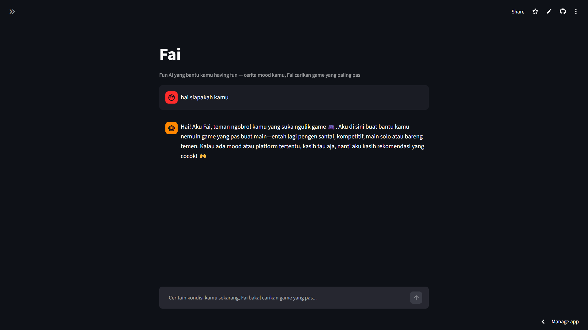
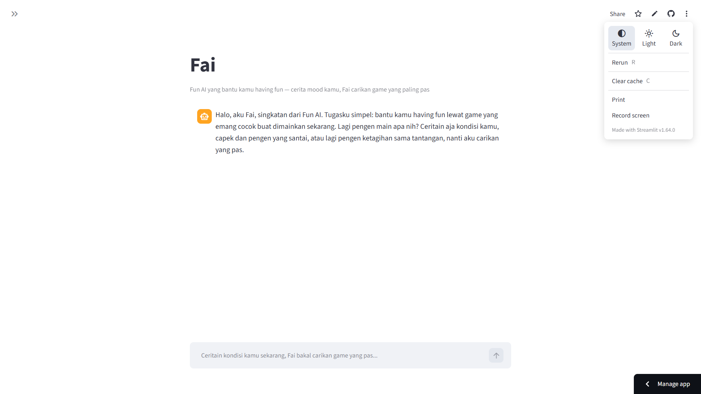
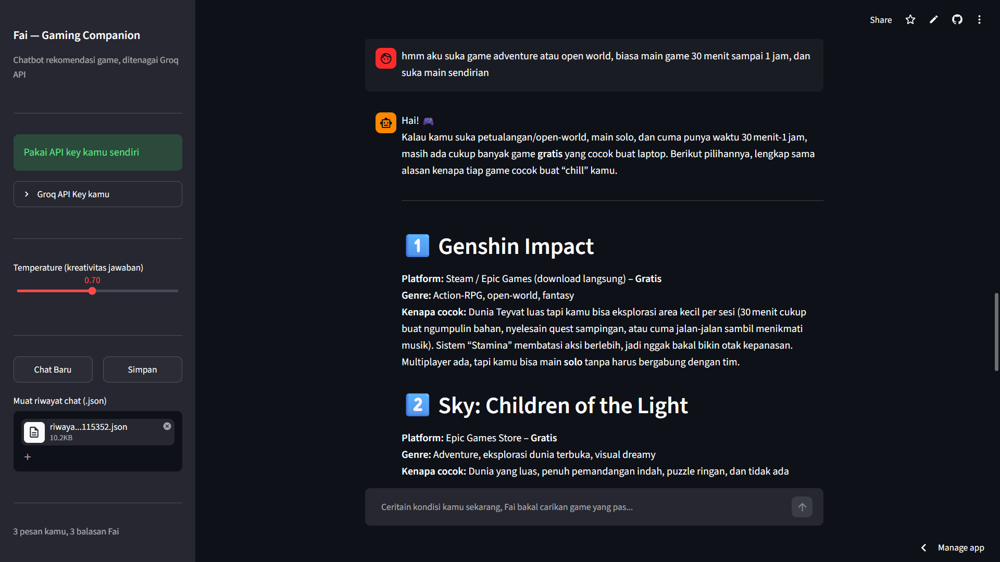
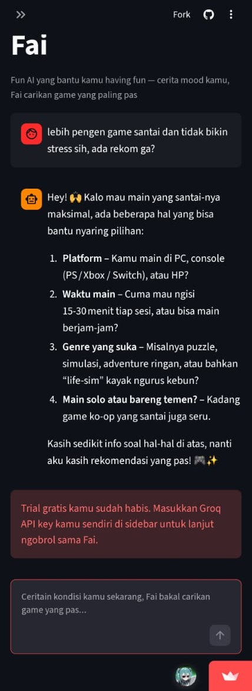

# Fai (Fun AI) Gaming Companion

## Identitas

- **Nama: Faishal Izzuddin Robbani**
- **NRP: 3323600017**

## Pengantar

Untuk tugas ini, saya mencoba dua pendekatan. Pertama, saya membangun chatbot sederhana berbasis console di Jupyter Notebook (`try_chatbot.ipynb`) mengikuti contoh dari praktikum kelas. Namun, sebagai chatbot utama yang dikumpulkan untuk tugas ini, saya membangun dan men-deploy **Fai**, chatbot berbasis Streamlit yang terhubung ke Groq API, yang bisa diakses langsung di:

**[chatbot-fai.streamlit.app](https://chatbot-fai.streamlit.app)**

## Tema Chatbot: Fai (Fun AI)

**Fai** adalah singkatan dari **Fun AI** sebuah gaming companion yang membantu pengguna menemukan game yang cocok untuk dimainkan berdasarkan kondisi dan keinginan mereka saat itu.

Konsepnya sederhana: alih-alih pengguna bingung sendiri harus main game apa, Fai mengajak ngobrol santai layaknya teman, menggali informasi seperti mood saat ini, waktu bermain yang tersedia, genre favorit, platform, sampai preferensi main sendiri atau bareng teman. Dari situ, Fai memberikan rekomendasi game beserta alasan singkat kenapa game tersebut cocok, dan tetap mengingat konteks yang sudah disebutkan sepanjang percakapan berlangsung.

## Cara Menggunakan

Chatbot ini sudah live dan bisa langsung dicoba tanpa instalasi apa pun:

1. Kunjungi **[chatbot-fai.streamlit.app](https://chatbot-fai.streamlit.app)**
2. Mulai ngobrol dengan Fai lewat kolom chat di bagian bawah

Fitur-fitur yang tersedia:

- **Trial chat gratis** pesan pertama bisa langsung dicoba secara gratis. Setelah jatah trial habis, kamu akan diminta memasukkan Groq API key milikmu sendiri lewat sidebar untuk melanjutkan percakapan.
- **Streaming response** jawaban Fai muncul bertahap, bukan langsung utuh sekaligus.
- **Mode Dark/Light** memanfaatkan fitur bawaan Streamlit, bisa diganti lewat menu Settings.
- **Pengaturan temperature** slider di sidebar untuk mengatur seberapa kreatif/variatif jawaban Fai.
- **Chat Baru** tombol untuk mereset percakapan dan mulai dari awal.
- **Simpan riwayat** tombol untuk mengunduh riwayat percakapan dalam format JSON.
- **Muat riwayat chat** fitur upload file JSON untuk memuat ulang percakapan sebelumnya.
- **Statistik percakapan** informasi jumlah pesan yang dikirim pengguna dan jumlah balasan dari Fai selama sesi berjalan.

## Cara Menjalankan di Lokal

Jika ingin menjalankan proyek ini di komputer sendiri (clone dari repo):

1. Clone repository:
   ```bash
   git clone <https://github.com/XiaoFai17/chatbot-fai>
   cd <chatbot-fai>
   ```

2. Install dependencies:
   ```bash
   pip install -r requirements.txt
   ```

3. (Opsional, untuk mencoba fitur trial secara lokal) buat file `.streamlit/secrets.toml` atau buat file `.env` berisi API key Groq milikmu sendiri:
   ```toml
   GROQ_API_KEY = "gsk_xxxxxxxxxxxxxxxxxxxx"
   ```
   Dapatkan API key gratis di [console.groq.com/keys](https://console.groq.com/keys). Tanpa file ini, fitur trial tidak aktif, tapi kamu tetap bisa chat dengan memasukkan API key secara manual di sidebar.

4. Jalankan aplikasi:
   ```bash
   streamlit run app.py
   ```

5. Buka browser ke alamat yang muncul di terminal (biasanya `http://localhost:8501`).

## Struktur Kode (`app.py`)

Kode utama `app.py` disusun dengan urutan sebagai berikut:

- **Konfigurasi dasar** pengaturan halaman Streamlit (`st.set_page_config`), definisi `SYSTEM_PROMPT` yang membentuk persona dan aturan main Fai sebagai gaming companion, teks `GREETING` sebagai sapaan pembuka, serta konstanta `MODEL_NAME` yang menentukan model Groq yang dipakai (`openai/gpt-oss-120b`).

- **Session state** inisialisasi state yang dipertahankan selama sesi pengguna berjalan: `messages` (riwayat percakapan), `trial_used` (status apakah jatah trial sudah dipakai), `user_api_key` (API key yang diinput pengguna sendiri), dan `last_loaded_file` (penanda file JSON terakhir yang berhasil dimuat, untuk mencegah pemrosesan berulang saat halaman rerun).

- **Fungsi bantu** `reset_chat()` untuk mengembalikan percakapan ke kondisi awal, `get_trial_key()` untuk mengambil API key trial milik developer dari `st.secrets`, dan `resolve_api_key()` untuk menentukan API key mana yang dipakai pada request berikutnya (milik user sendiri jika sudah diisi, atau key trial jika jatahnya belum terpakai).

- **Sidebar** menampilkan status trial/API key, form input API key milik pengguna, slider pengaturan temperature, tombol Chat Baru dan Simpan (download JSON), fitur upload file JSON untuk memuat riwayat lama, serta statistik jumlah pesan.

- **Render riwayat chat** menampilkan seluruh isi `messages` sebagai bubble chat, dan menampilkan `GREETING` sebagai sapaan statis saat percakapan baru dimulai (tidak memanggil API sehingga tidak memakan jatah trial).

- **Input & logika chat** menangani pesan baru dari pengguna: memeriksa ketersediaan API key lewat `resolve_api_key()`, mengirim seluruh riwayat percakapan ke Groq API dengan `stream=True` untuk menghasilkan jawaban secara bertahap, menampilkannya secara live ke layar, menangani berbagai jenis error (API key tidak valid, rate limit, timeout) tanpa membuat aplikasi crash, serta memperbarui status `trial_used` setelah trial terpakai.

## Dokumentasi Percakapan

Berikut beberapa dokumentasi percakapan dengan Fai:







<div align="center">
  
</div>